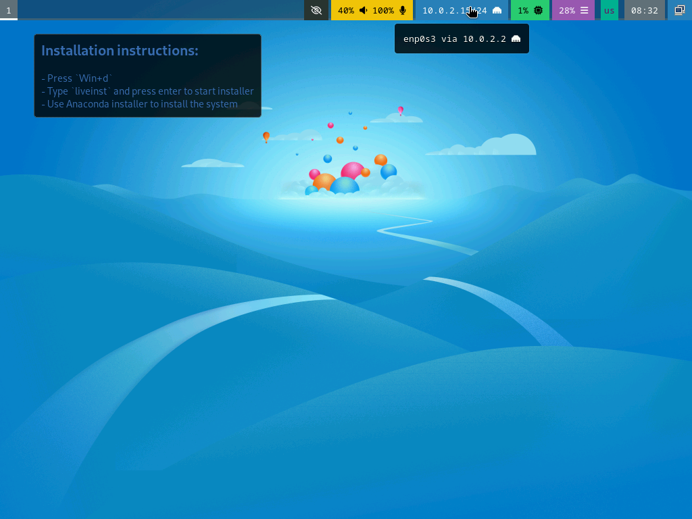
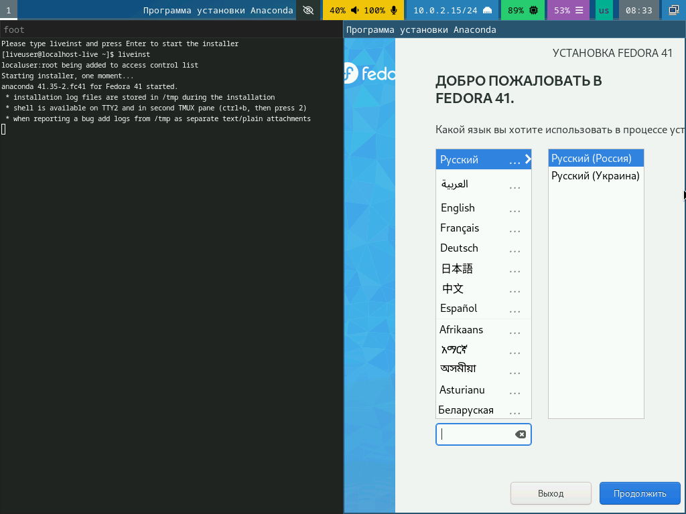
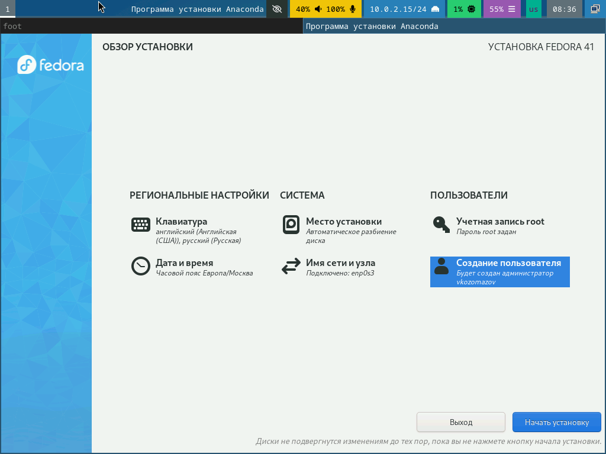
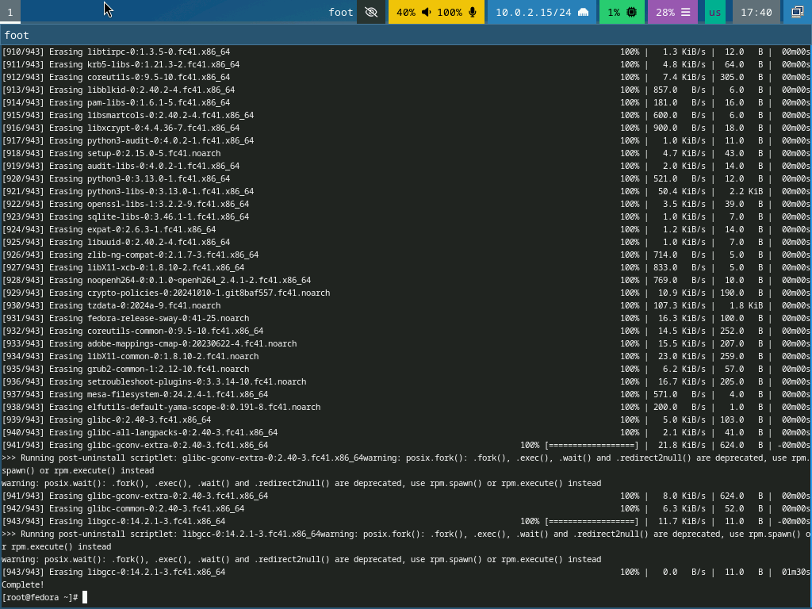
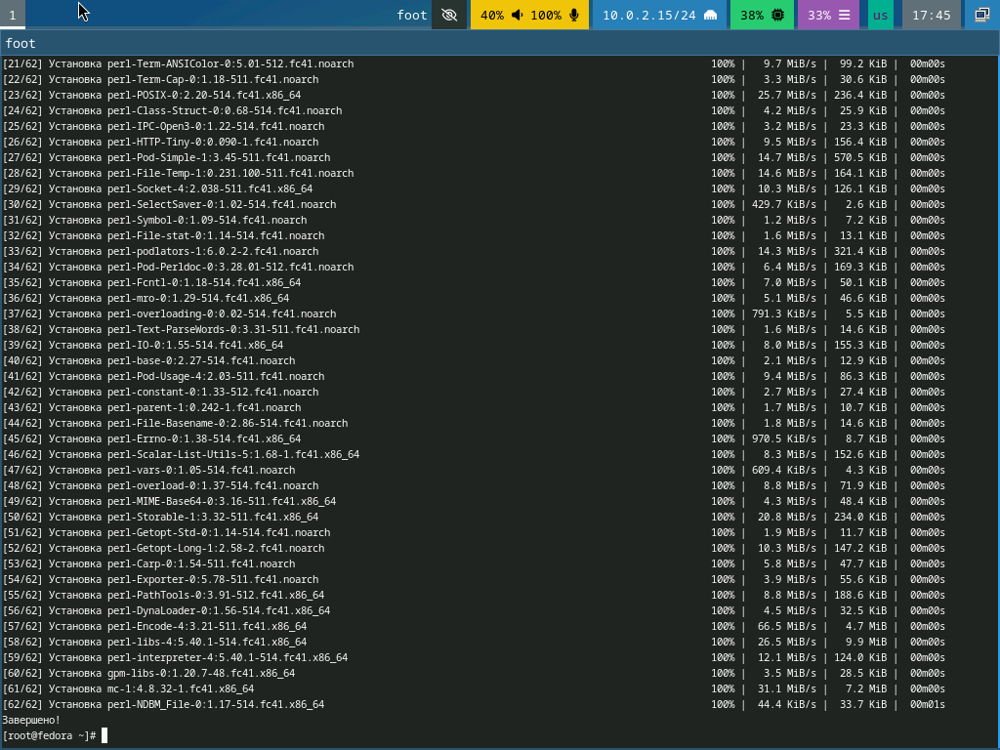
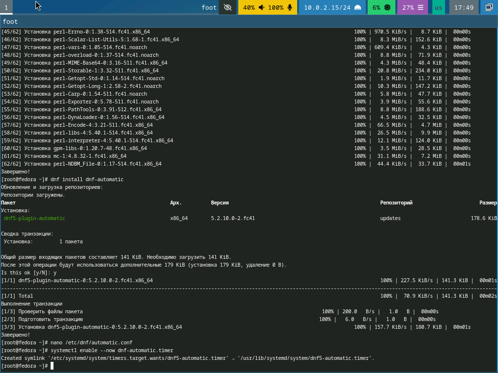
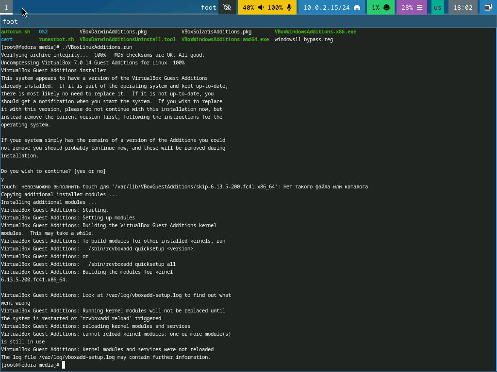
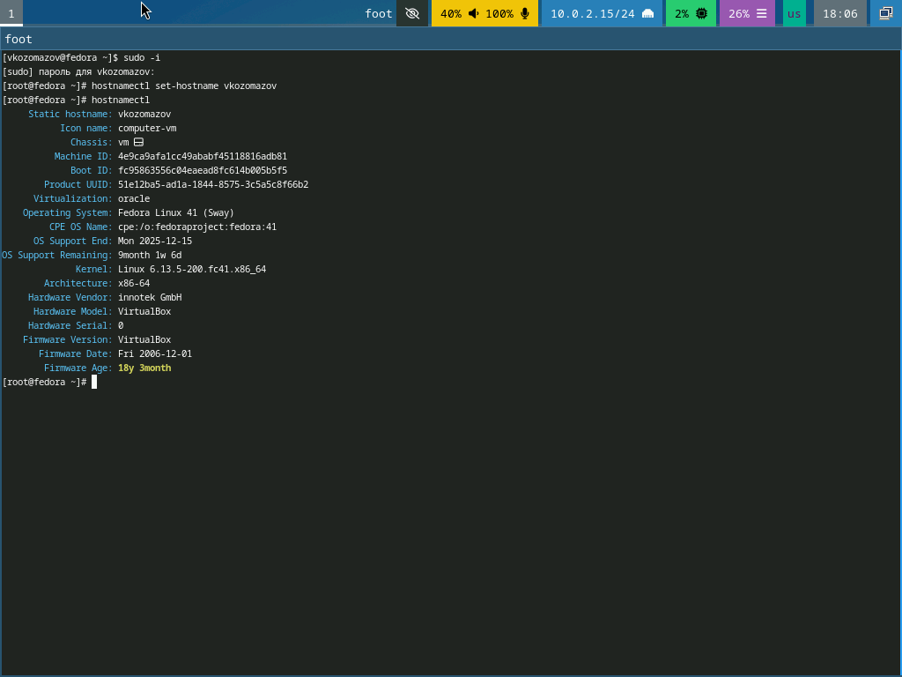
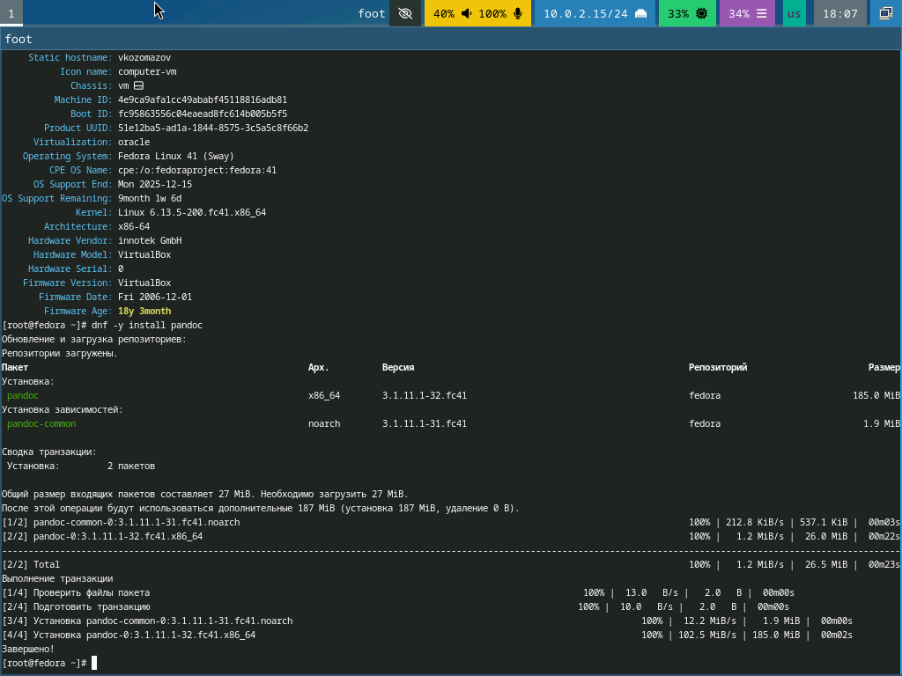
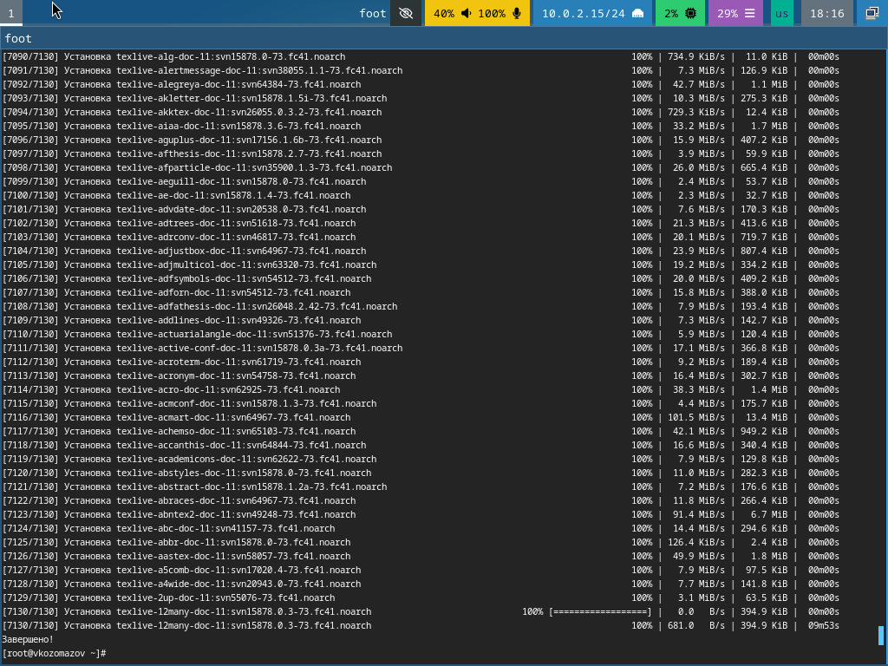

---
## Front matter
title: "Создание образа виртуальной машины"
subtitle: "Отчёт по лабораторной работе №1"
author: "Козомазов Владимир Романович"

## Generic otions
lang: ru-RU
toc-title: "Содержание"

## Bibliography
bibliography: bib/cite.bib
csl: pandoc/csl/gost-r-7-0-5-2008-numeric.csl

## Pdf output format
toc: true # Table of contents
toc-depth: 2
lof: true # List of figures
lot: true # List of tables
fontsize: 12pt
linestretch: 1.5
papersize: a4
documentclass: scrreprt
## I18n polyglossia
polyglossia-lang:
  name: russian
  options:
	- spelling=modern
	- babelshorthands=true
polyglossia-otherlangs:
  name: english
## I18n babel
babel-lang: russian
babel-otherlangs: english
## Fonts
mainfont: IBM Plex Serif
romanfont: IBM Plex Serif
sansfont: IBM Plex Sans
monofont: IBM Plex Mono
mathfont: STIX Two Math
mainfontoptions: Ligatures=Common,Ligatures=TeX,Scale=0.94
romanfontoptions: Ligatures=Common,Ligatures=TeX,Scale=0.94
sansfontoptions: Ligatures=Common,Ligatures=TeX,Scale=MatchLowercase,Scale=0.94
monofontoptions: Scale=MatchLowercase,Scale=0.94,FakeStretch=0.9
mathfontoptions:
## Biblatex
biblatex: true
biblio-style: "gost-numeric"
biblatexoptions:
  - parentracker=true
  - backend=biber
  - hyperref=auto
  - language=auto
  - autolang=other*
  - citestyle=gost-numeric
## Pandoc-crossref LaTeX customization
figureTitle: "Рис."
tableTitle: "Таблица"
listingTitle: "Листинг"
lofTitle: "Список иллюстраций"
lotTitle: "Список таблиц"
lolTitle: "Листинги"
## Misc options
indent: true
header-includes:
  - \usepackage{indentfirst}
  - \usepackage{float} # keep figures where there are in the text
  - \floatplacement{figure}{H} # keep figures where there are in the text
---

# Цель работы

Целью данной работы являются:
  - приобретение практических навыков установки операционной системы на виртуальную машину;
  - настройки минимально необходимых для работы сервисов.

# Задание

Установить и настроить виртуальную машину для работы

# Теоретическое введение

Виртуальные машины (ВМ) используются для различных целей, предоставляя гибкость, изоляцию и эффективность в работе с программным обеспечением и системами. Вот основные причины их использования:

   1. Изоляция сред
      - Виртуальные машины позволяют запускать несколько операционных систем (ОС) на одном физическом сервере. Это полезно для тестирования программного обеспечения в разных средах без необходимости использования отдельных физических устройств.
      - Изоляция также повышает безопасность, так как сбои или уязвимости в одной виртуальной машине не влияют на другие.

   2. Экономия ресурсов
      - ВМ позволяют эффективно использовать ресурсы сервера, так как на одном физическом сервере можно запускать несколько виртуальных машин. Это снижает затраты на оборудование и энергопотребление.

   3. Тестирование и разработка
      - Разработчики используют виртуальные машины для тестирования приложений в разных операционных системах (например, Windows, Linux, macOS) без необходимости перезагрузки компьютера.
      - Это также полезно для тестирования новых версий программного обеспечения или обновлений в изолированной среде.

   4. Обучение и эксперименты
      - Виртуальные машины позволяют безопасно экспериментировать с новыми технологиями, настройками или операционными системами без риска повредить основную систему.

   5. Создание резервных копий и восстановление
      - ВМ можно легко копировать, переносить и восстанавливать. Это упрощает процесс создания резервных копий и восстановления систем в случае сбоев.

   6. Запуск устаревшего ПО
      - Виртуальные машины позволяют запускать устаревшие программы или операционные системы, которые не поддерживаются на современных платформах.

   7. Облачные вычисления
      - В облачных сервисах виртуальные машины используются для предоставления пользователям вычислительных ресурсов. Это позволяет масштабировать приложения и сервисы в зависимости от потребностей.

   8. Создание песочниц (sandbox)
      - Виртуальные машины могут использоваться для создания изолированных сред (песочниц), где можно безопасно запускать подозрительные программы или анализировать вредоносное ПО.

   9. Упрощение развертывания
      - ВМ можно легко переносить между физическими серверами, что упрощает развертывание и масштабирование приложений.

   10. Поддержка разных платформ
      - Виртуальные машины позволяют запускать приложения, предназначенные для одной ОС, на другой (например, запуск Windows-программ на Linux через виртуализацию).

   Популярные платформы для виртуализации:
      - VMware,
      - VirtualBox,
      - Hyper-V,
      - KVM,
      - Xen.

Таким образом, виртуальные машины — это мощный инструмент для повышения гибкости, безопасности и эффективности в ИТ-инфраструктуре.

# Выполнение лабораторной работы

Первый запуск виртуальной машины(рис. [-@fig:001]).

{#fig:001 width=70%}

Выполнение команды Liveinst (рис. [-@fig:002])

{#fig:002 width=70%}

Создал учётную запись (рис. [-@fig:003])

{#fig:003 width=70%}

Проверил установку пользователя (рис. [-@fig:004])

{#fig:004 width=70%}

Установил обновления командой `dnf update` (рис. [-@fig:005])

{#fig:005 width=70%}

Установил tmux и mc (рис. [-@fig:006])

{#fig:006 width=70%}

Установил автообновления (рис. [-@fig:007])

{#fig:007 width=70%}

Установил драйверов для виртуальной машины (рис. [-@fig:008])

{#fig:008 width=70%}

Изменил имя хоста на vkozomazov (рис. [-@fig:009])

{#fig:009 width=70%}

Установил pandoc (рис. [-@fig:010])

{#fig:010 width=70%}

Установил texlive (рис. [-@fig:011])

{#fig:011 width=70%}

# Выводы

Лабораторная работа позволила получить ценный опыт работы с виртуальными машинами, что является важным шагом в освоении современных ИТ-технологий. Полученные знания и навыки могут быть применены как в учебных, так и в профессиональных целях.

# Список литературы{.unnumbered}

::: {#refs}
:::
