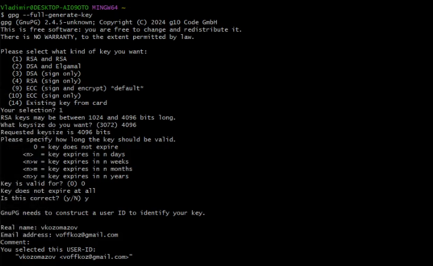
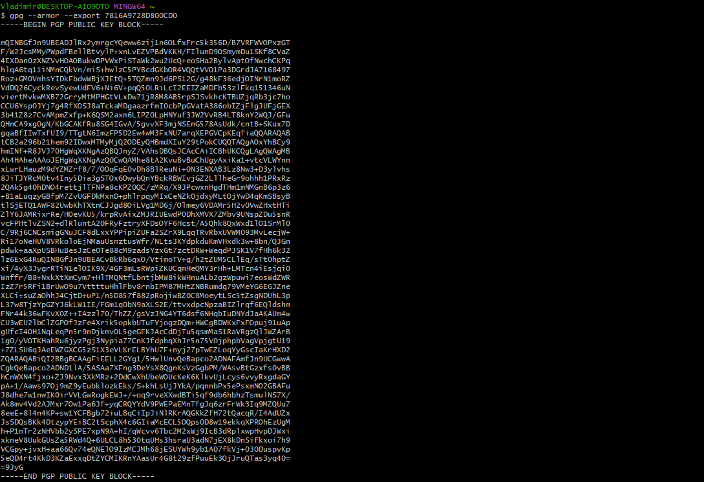
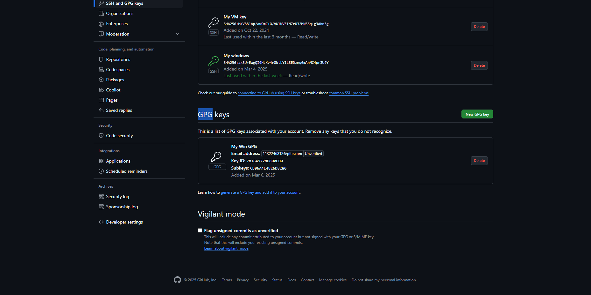

---
## Front matter
title: "Системы контроля версий"
subtitle: "Лабораторная работа №2"
author: "Козомазов Владимир Романович"

## Generic otions
lang: ru-RU
toc-title: "Содержание"

## Bibliography
bibliography: bib/cite.bib
csl: pandoc/csl/gost-r-7-0-5-2008-numeric.csl

## Pdf output format
toc: true # Table of contents
toc-depth: 2
lof: true # List of figures
lot: true # List of tables
fontsize: 12pt
linestretch: 1.5
papersize: a4
documentclass: scrreprt
## I18n polyglossia
polyglossia-lang:
  name: russian
  options:
	- spelling=modern
	- babelshorthands=true
polyglossia-otherlangs:
  name: english
## I18n babel
babel-lang: russian
babel-otherlangs: english
## Fonts
mainfont: IBM Plex Serif
romanfont: IBM Plex Serif
sansfont: IBM Plex Sans
monofont: IBM Plex Mono
mathfont: STIX Two Math
mainfontoptions: Ligatures=Common,Ligatures=TeX,Scale=0.94
romanfontoptions: Ligatures=Common,Ligatures=TeX,Scale=0.94
sansfontoptions: Ligatures=Common,Ligatures=TeX,Scale=MatchLowercase,Scale=0.94
monofontoptions: Scale=MatchLowercase,Scale=0.94,FakeStretch=0.9
mathfontoptions:
## Biblatex
biblatex: true
biblio-style: "gost-numeric"
biblatexoptions:
  - parentracker=true
  - backend=biber
  - hyperref=auto
  - language=auto
  - autolang=other*
  - citestyle=gost-numeric
## Pandoc-crossref LaTeX customization
figureTitle: "Рис."
tableTitle: "Таблица"
listingTitle: "Листинг"
lofTitle: "Список иллюстраций"
lotTitle: "Список таблиц"
lolTitle: "Листинги"
## Misc options
indent: true
header-includes:
  - \usepackage{indentfirst}
  - \usepackage{float} # keep figures where there are in the text
  - \floatplacement{figure}{H} # keep figures where there are in the text
---

# Цель работы

- Изучить идеологию и применение средств контроля версий.
- Освоить умения по работе с git.

# Задание

- Создать базовую конфигурацию для работы с git.
- Создать ключ SSH.
- Создать ключ PGP.
- Настроить подписи git.
- Зарегистрироваться на Github.
- Создать локальный каталог для выполнения заданий по предмету.

# Теоретическое введение

### Теоретическое введение по регистрации в GitHub

GitHub — это одна из самых популярных платформ для совместной разработки программного обеспечения, основанная на системе контроля версий Git. Она предоставляет инструменты для управления кодом, отслеживания задач, совместной работы и автоматизации процессов разработки. Регистрация на GitHub — это первый шаг к использованию всех возможностей этой платформы.

---

### 1. **Что такое GitHub?**
   - **GitHub** — это веб-сервис, который предоставляет хостинг для репозиториев Git. Он позволяет разработчикам хранить код, управлять версиями, сотрудничать с другими участниками и автоматизировать процессы разработки.
   - GitHub поддерживает как публичные (открытые для всех), так и приватные (доступные только для определенных пользователей) репозитории.
   - Платформа также предоставляет дополнительные функции, такие как Issues (для отслеживания задач), Wiki (для документации), Projects (для управления проектами) и Actions (для CI/CD).

---

### 2. **Зачем нужна регистрация на GitHub?**
   Регистрация на GitHub открывает доступ к следующим возможностям:
   - **Хранение кода**: Создание репозиториев для хранения и управления проектами.
   - **Совместная работа**: Возможность приглашать других разработчиков для работы над проектами.
   - **Контроль версий**: Использование Git для отслеживания изменений в коде.
   - **Участие в open-source**: Возможность вносить вклад в открытые проекты.
   - **Автоматизация**: Использование GitHub Actions для настройки CI/CD (непрерывной интеграции и доставки).
   - **Документирование**: Создание Wiki и README-файлов для описания проектов.

---

### 3. **Основные понятия**
   - **Репозиторий**: Хранилище кода, которое содержит все файлы проекта, историю изменений и настройки.
   - **Коммит (Commit)**: Отдельное изменение в коде, которое сохраняется в истории репозитория.
   - **Ветка (Branch)**: Изолированная версия кода, которая позволяет работать над новыми функциями или исправлениями, не затрагивая основную версию.
   - **Пул-реквест (Pull Request)**: Запрос на объединение изменений из одной ветки в другую. Используется для проверки и обсуждения кода перед его внесением в основную ветку.
   - **Issues**: Задачи или баги, которые необходимо решить в рамках проекта.
   - **Wiki**: Документация проекта, которая может быть создана и отредактирована участниками.

---

### 4. **Процесс регистрации**
   Регистрация на GitHub включает следующие шаги:
   1. **Переход на сайт GitHub**: Открыть сайт [github.com](https://github.com).
   2. **Заполнение формы регистрации**:
      - Ввод имени пользователя (username), которое будет использоваться для доступа к репозиториям и профилю.
      - Ввод адреса электронной почты.
      - Создание пароля.
   3. **Подтверждение учетной записи**:
      - Подтверждение электронной почты, указанной при регистрации.
   4. **Настройка профиля**:
      - Добавление аватарки, имени и краткого описания.
      - Настройка двухфакторной аутентификации (2FA) для повышения безопасности.

---

### 5. **Настройка учетной записи**
   После регистрации важно настроить учетную запись для удобства и безопасности:
   - **Двухфакторная аутентификация (2FA)**: Добавление дополнительного уровня защиты.
   - **SSH-ключи**: Настройка SSH для безопасного взаимодействия с репозиториями без необходимости ввода пароля.
   - **Интеграция с IDE**: Настройка интеграции GitHub с популярными средами разработки, такими как Visual Studio Code, IntelliJ IDEA и другими.

---

### 6. **Первый шаг после регистрации**
   После регистрации рекомендуется:
   - Создать первый репозиторий.
   - Изучить интерфейс GitHub (вкладки Repositories, Issues, Pull Requests, Actions и другие).
   - Попробовать выполнить базовые операции с Git (клонирование репозитория, создание коммитов, создание веток).

---

# Выполнение лабораторной работы

Проверил установку git с помощью команды `git --version` (рис. [-@fig:001]).

{#fig:001 width=70%}

Проверил установку gh с помощью команды `gh -version` (рис. [-@fig:002]).

{#fig:002 width=70%}

Проверил имя владельца репозитория командой `git config --global user.name` (рис. [-@fig:003]).

{#fig:003 width=70%}

Проверил email владельца репозитория командой `git config --global user.email` (рис. [-@fig:004]).

{#fig:004 width=70%}

Настроил utf-8 в выводе сообщений git командой `git config --global core.quotepath false` (рис. [-@fig:005]).

{#fig:005 width=70%}

Проверил наличие SSH ключа командой `ls ~/.ssh` (рис. [-@fig:006]).

{#fig:006 width=70%}

Создал ключ gpg с помощью команды `gpg --full-generate-key` и выбрал необходимые опции (рис. [-@fig:007]).

{#fig:007 width=70%}

Вывел список ключей командой `gpg --list-secret-keys --keyid-format LONG` (рис. [-@fig:008]).

{#fig:008 width=70%}

Вывел на экран сгенерированный gpg ключ командйо `gpg --armor --export 7816A9728D800CD0` и скопировал в буфер обмена (рис. [-@fig:009]).

{#fig:010 width=70%}

Добавил gpg ключ на github (рис. [-@fig:010]).

{#fig:009 width=70%}

Настроил автоматичесие подписи коммитов git (рис. [-@fig:011]).

{#fig:011 width=70%}

# Выводы

Работа по регистрации и настройке GitHub позволила получить базовые навыки, необходимые для эффективного использования этой платформы. GitHub является неотъемлемой частью современной разработки, и освоение его функций открывает широкие возможности для участия в open-source проектах, командной работе и профессионального роста. Полученные знания и навыки могут быть применены как в учебных, так и в профессиональных целях.

# Список литературы{.unnumbered}

::: {#refs}
:::
